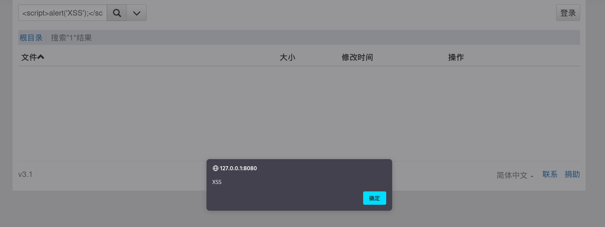

# Exploit Title: [There is a XSS vulnerability in search function of CuteHttpFileServer]
## Google Dork: [CuteHttpFileServer]
## Date: [February 17th, 2025]
## Exploit Author: [FYHypo]
## Vendor Homepage: [http://iscute.cn/chfs]
## Software Link: [https://github.com/ods-im/CuteHttpFileServer]
## Version: [CuteHttpFileServer/v3.1]
## Tested on: [linux/remote]
## detail：

search function is here.Just search anything first

After the jump, enter an xss statement in the search box, such as 

